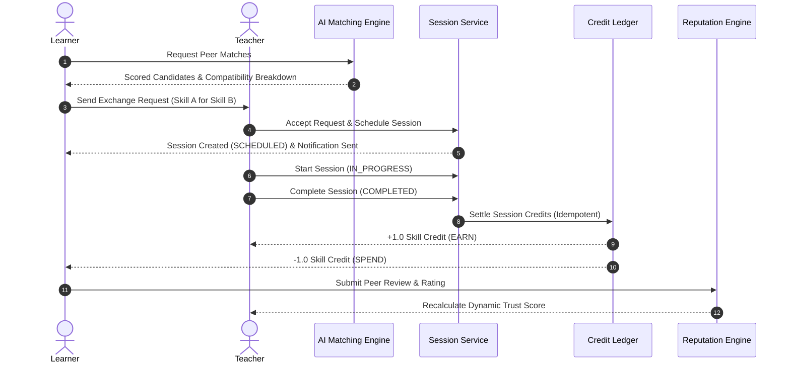

# SkillBarter AI — AI-Powered Skill Exchange & Learning Marketplace

> Connect with institutional peers for peer-to-peer skill exchanges powered by multi-tenant security, skill matching, session scheduling, credit ledger, dynamic reputation, and AI learning roadmaps.

---

## 🌟 Project Overview

**SkillBarter AI** is a multi-tenant, AI-ready skill exchange platform where students and professionals within institutions trade skills peer-to-peer (e.g. *"I will teach you Java OOP in exchange for learning System Design or React"*).

The platform is designed as a **Modular Monolith** with clean domain boundary separation, stateless JWT security, strict institutional multi-tenancy, and a modern **Clean Light SaaS UI** (Linear × Notion × fintech aesthetic).

---

## 🚀 Key Features

### 🟢 Phase 1 — Foundation & Security Infrastructure
- **Multi-Tenant Isolation:** Tenant identity derived strictly from JWT authentication context (`TenantContext` ThreadLocal). Cross-tenant data leakage is impossible by design.
- **Stateless JWT & Token Rotation:** Short-lived access tokens (15 min) + long-lived refresh tokens (7 days) with rotation and automatic reuse detection/revocation.
- **RBAC Security:** Roles (`SUPER_ADMIN`, `TENANT_ADMIN`, `STUDENT`) with Spring Security authorization rules.
- **Audit Logging:** System security logs for login events, token reuse detection, and sensitive actions.
- **Rate Limiting:** Sliding-window rate limiting on login/registration endpoints.

### 🟢 Phase 2 — Skill Ecosystem & Core Marketplace
- **Skill Taxonomy & Catalog:** Hierarchical skill categories (`Programming`, `Design`, `DevOps`, etc.), skills, and skill prerequisites.
- **User Skill Profiles:** Users specify skills they **Can Teach** (with proficiency level and years of experience) and skills they **Want to Learn**.
- **Learning Goals:** Define target skills, current level, desired target level (`BEGINNER`, `INTERMEDIATE`, `ADVANCED`, `EXPERT`), completion deadlines, and learning preferences.
- **Marketplace & Peer Discovery:**
  - Search skills by name or category filter.
  - **Inline Peer Discovery:** Discover all qualified peers in your institution who teach a selected skill.
  - **Skill Exchange Requests:** Propose exchange requests specifying *"Skill I Offer"* vs *"Skill I Want"* with custom messages.
  - **Request Lifecycle Management:** Pending exchange request alerts on the dashboard with instant **Accept** / **Decline** actions.
- **Skill Match Recommendation Engine:** Matches peers whose offered teachable skills align with your declared learning targets and goals.

### 🟢 Phase 3 — Exchange Engine & Reputation Ecosystem
- **User Availability & Overlap Calculation:** Timezone-aware weekly availability schedules (`AvailabilityOverlapService`) calculating overlap minutes for schedule compatibility scoring.
- **Multi-Factor AI Matching Engine:** Deterministic scoring across 5 weighted dimensions (Skill Compatibility 35%, Goal Alignment 25%, Availability Overlap 20%, Proficiency Balance 10%, Trust Score 10%).
- **Session Lifecycle & Scheduling:** Full session state machine (`SCHEDULED` $\rightarrow$ `IN_PROGRESS` $\rightarrow$ `COMPLETED` / `CANCELLED` / `NO_SHOW` / `DISPUTED`) with server-side double-booking conflict prevention.
- **Skill Credits Ledger:** Immutable credit transaction wallet (+1.0 Credit earned for teaching, -1.0 Credit spent for learning) triggered automatically and idempotently on session completion.
- **Reputation & Dynamic Trust Score:** Dynamic 5-component trust score algorithm (Rating 40%, Completion Rate 20%, Reliability 20%, Response Rate 10%, Cancellation Penalty 10%) with verified peer reviews.
- **In-App Notifications:** Real-time notification bell dropdown for session state changes, credit settlements, reviews, and exchange request alerts.
- **Dispute Resolution Foundation:** Dispute creation and tracking workflow for session non-compliance or issues.

---

## 🔄 Phase 3 Exchange Engine Workflow



---

## 🎨 Design System

Built with a **Clean Light SaaS** direction (*"Human + Technology + Trust"*):

| Token | Hex Code | Purpose |
|---|---|---|
| **Primary Navy** | `#0B1220` | Sidebar background, hero left panels, primary text headings |
| **Primary Teal** | `#14B8A6` | Primary action buttons, active navigation indicator, key icons |
| **Growth Mint** | `#5EEAD4` | Mint badges, hover highlights, progress elements |
| **AI Accent** | `#3B82F6` | AI match recommendation card accents (`#14B8A6` → `#3B82F6`) |
| **App Canvas** | `#F8FAFC` | Main content canvas area |
| **Card Surface** | `#FFFFFF` | All content cards, modals, and input fields |
| **Border Color** | `#E2E8F0` | Subtle clean card borders (no heavy drop shadows) |
| **Primary Text** | `#0F172A` | Card titles, user names, main text hierarchy |
| **Secondary Text** | `#64748B` | Subtitles, helper text, category labels |

---

## 🛠️ Technology Stack

### Backend
- **Framework:** Spring Boot 3.4 (Java 21)
- **Security:** Spring Security, JJWT (SHA-512), BCrypt (cost 12)
- **Database:** MySQL 8.0+ + Flyway schema migrations
- **ORM:** Spring Data JPA / Hibernate (`CHAR(36)` UUID mapping via `@JdbcTypeCode`)
- **API Docs:** SpringDoc OpenAPI 3 (Swagger UI)

### Frontend
- **Framework:** React 18, TypeScript, Vite
- **Styling:** Tailwind CSS 3 (Vanilla CSS utility extensions)
- **Icons:** Lucide React
- **HTTP Client:** Axios with request/response interceptors + automatic JWT refresh rotation

---

## 📂 Project Architecture

```text
skillbarter-ai/
├── backend/
│   ├── src/main/java/com/skillbarter/
│   │   ├── common/         # Security (JWT, TenantContext), exceptions, config, CORS
│   │   ├── tenant/         # Institution tenant entity & services
│   │   ├── identity/       # Auth: Login, Register, Refresh Token Rotation
│   │   ├── user/           # User profile management & security audit logging
│   │   ├── skill/          # Skill taxonomy, categories, user skills, learning goals
│   │   ├── marketplace/    # Exchange requests & peer match recommendation engine
│   │   ├── availability/   # Weekly availability slots & timezone-aware overlap calculator
│   │   ├── matching/       # Configurable multi-factor weighted matching engine
│   │   ├── session/        # Session lifecycle state machine & conflict prevention
│   │   ├── credits/        # Skill credits wallet & immutable ledger transactions
│   │   ├── reputation/     # Verified peer reviews & dynamic trust score algorithm
│   │   ├── notification/   # In-app notifications & domain event dispatching
│   │   └── dispute/        # Session dispute cases & resolution workflow
│   └── src/main/resources/
│       └── db/migration/   # Flyway V1 (Identity), V2 (Skill Ecosystem), V3 (Exchange Engine)
├── frontend/
│   ├── src/
│   │   ├── components/     # UI primitives (Button, Card, Badge), NotificationDropdown, Layout
│   │   ├── features/       # Feature pages: auth, dashboard, skills, goals, matches, availability, sessions, credits, reputation, disputes
│   │   ├── lib/            # Auth context provider & API client helper functions
│   │   └── types/          # TypeScript interface definitions
│   └── index.html
└── docker-compose.yml
```

---

## 🚦 Quick Start Guide

### Prerequisites
- **Java 21** or higher
- **Node.js 18** or higher
- **MySQL 8.0** or Docker

### 1. Environment Setup

Copy `.env.example` to `.env` in the root directory:

```bash
cp .env.example .env
```

Ensure your `.env` contains:
```env
JWT_SECRET=your_super_secret_jwt_key_that_is_at_least_64_characters_long_for_security
DATABASE_URL=jdbc:mysql://localhost:3306/skillbarter?useSSL=false&allowPublicKeyRetrieval=true&serverTimezone=UTC
DATABASE_USERNAME=skillbarter
DATABASE_PASSWORD=changeme
```

### 2. Run Database (Docker option)

```bash
docker run -d --name skillbarter-db \
  -e MYSQL_DATABASE=skillbarter \
  -e MYSQL_USER=skillbarter \
  -e MYSQL_PASSWORD=changeme \
  -e MYSQL_ROOT_PASSWORD=root_changeme \
  -p 3306:3306 mysql:8.0
```

### 3. Start Backend (Spring Boot)

```bash
cd backend
./mvnw spring-boot:run
```
*or on Windows PowerShell:*
```powershell
cd backend
.\mvnw.cmd spring-boot:run
```

- **API Base:** `http://localhost:8080/api/v1`
- **Swagger UI Docs:** `http://localhost:8080/swagger-ui.html`
- **Health Check:** `http://localhost:8080/api/v1/health`

### 4. Start Frontend (React + Vite)

```bash
cd frontend
npm install
npm run dev
```

- **Frontend Application:** `http://localhost:5173`

---

## 🗄️ Database Schema Migrations (Flyway)

| Migration File | Description |
|---|---|
| `V1__initial_schema.sql` | Core identity: `tenants`, `users`, `roles`, `user_roles`, `refresh_tokens`, `audit_logs` |
| `V2__skill_ecosystem.sql` | Marketplace ecosystem: `skill_categories`, `skills`, `skill_prerequisites`, `user_skills`, `learning_goals`, `exchange_requests` |
| `V3__exchange_engine.sql` | Phase 3 Exchange Engine: `user_availability`, `sessions`, `credit_wallets`, `credit_transactions`, `reviews`, `trust_scores`, `notifications`, `disputes` |

---

## 🔗 Key REST API Endpoints

### Auth & Multi-Tenancy
- `POST /api/v1/auth/register` — Register user under an institution tenant
- `POST /api/v1/auth/login` — Authenticate user & receive JWT access + refresh tokens
- `POST /api/v1/auth/refresh` — Rotate refresh token for new access token
- `GET /api/v1/users/me` — Get current user profile

### Availability & Matching
- `GET /api/v1/users/me/availability` — List weekly availability slots
- `POST /api/v1/users/me/availability` — Add availability time slot
- `GET /api/v1/matches` — Get multi-factor scored peer matches

### Sessions & Exchange Execution
- `POST /api/v1/sessions` — Schedule session from exchange request
- `GET /api/v1/sessions` — List user's sessions with status filters
- `PATCH /api/v1/sessions/{id}/start` — Start session (`IN_PROGRESS`)
- `PATCH /api/v1/sessions/{id}/complete` — Complete session & settle credits (`COMPLETED`)

### Skill Credits & Reputation
- `GET /api/v1/credits/wallet` — Check credit wallet balance
- `GET /api/v1/credits/transactions` — Ledger transaction history
- `POST /api/v1/sessions/{id}/review` — Submit peer rating & review
- `GET /api/v1/users/{id}/trust-score` — View calculated reputation trust score

### Notifications & Disputes
- `GET /api/v1/notifications` — Fetch in-app notifications
- `PATCH /api/v1/notifications/{id}/read` — Mark notification read
- `POST /api/v1/sessions/{id}/disputes` — Raise session dispute

---

## 🧪 Testing

### Backend Unit & Integration Tests
```bash
cd backend
./mvnw test
```
*Includes unit test suite (`AvailabilityOverlapServiceTest`, `SessionStateValidatorTest`, `CreditServiceTest`) and full end-to-end integration test (`Phase3CompleteJourneyIT`).*

### Frontend Build Verification
```bash
cd frontend
npm run build
```

---

## 📄 Architecture Decision Records (ADRs)

| ADR ID | Title |
|---|---|
| `ADR-001` | Modular Monolith Architecture |
| `ADR-002` | Multi-Tenant Isolation Pattern |
| `ADR-003` | Refresh Token Rotation & Reuse Detection |
| `ADR-004` | Skill Taxonomy & Hierarchical Prerequisites |
| `ADR-005` | Skill Level & Learning Goal Model |
| `ADR-006` | Availability Model & Overlap Detection |
| `ADR-007` | AI Matching Engine Design |
| `ADR-008` | Session Lifecycle & Conflict Management |
| `ADR-009` | Reputation & Dynamic Trust Score Calculation |
| `ADR-010` | Notification Architecture & Event Decoupling |

---

## 📄 License

MIT License — see `LICENSE` for details.
